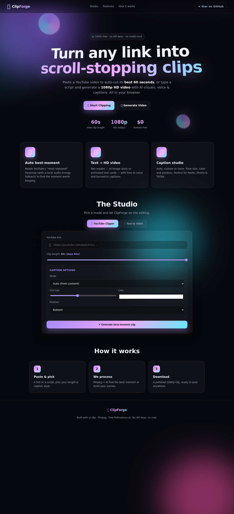
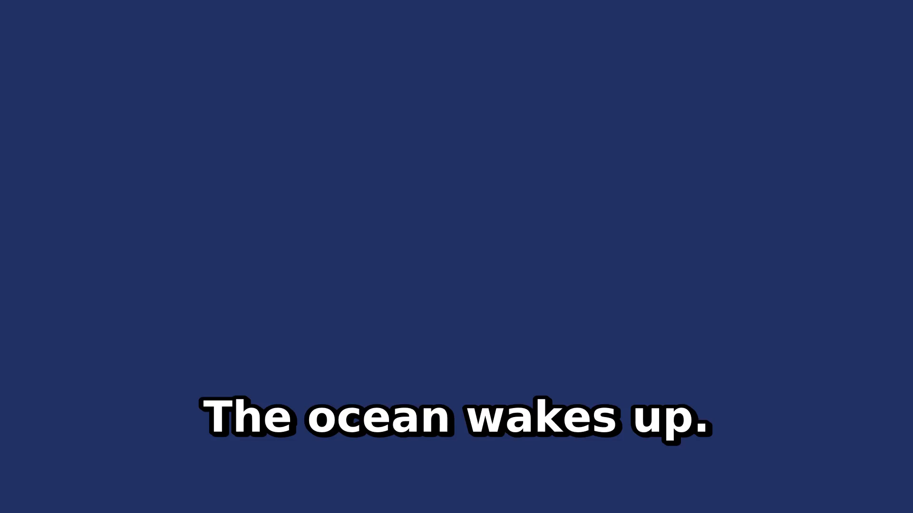

<p align="center">
  
</p>

<h1 align="center">🎬 ClipForge</h1>
<p align="center"><b>Free YouTube auto-clipper &amp; text-to-video studio</b></p>

<p align="center">
  
  
  
  
  
</p>

ClipForge turns a YouTube link into a **1-minute highlight clip** (auto-detecting the
best moment) and turns a script into a **1080p HD video** — with AI images, voice,
and burned-in captions. No API keys, no cost.

---

## ✨ Features

- **🎞️ YouTube Clipper** — paste a link, get the best ~60s. Detection uses YouTube's
  *most-replayed* heatmap (scraped, no key) with a local **audio-energy fallback**.
- **✨ Text-to-Video** — two modes:
  - 🖼️ **AI Image Story** — each sentence → AI image + narration.
  - 🔤 **Text Cards** — each sentence → animated caption card.
- **🔤 Captions** — auto / custom / off, with size, color & position controls.
- **🎵 Ambient music** — generated with ffmpeg (no asset files needed).
- **☁️ Deploy anywhere** — Docker-based, one-click to Render / Railway free tiers.

---

## 📸 The app

<p align="center">
  
</p>

> The studio: switch between the YouTube Clipper and Text-to-Video, set length,
> voice, music and captions, then watch live progress and download the result.

---

## 🧪 Proof it works

A real frame extracted from a video generated by the engine in this repo
(network-free fallback path — Pollinations images are swapped for solid-color
placeholders locally; on deploy the real AI images are used):

<p align="center">
  
</p>

A full sample clip is included too: [`assets/proof-video.mp4`](assets/proof-video.mp4).

---

## 🛠️ How it works

```
Browser ──POST /api/clip | /api/ttv──▶ Python server (stdlib http.server)
                                         │
                            background worker thread
                       ├─ yt-dlp        (download YouTube)
                       ├─ ffmpeg        (cut / assemble / burn captions)
                       └─ Pollinations  (free AI images + TTS)
                                         │
                  GET /api/status/<id>  (poll progress)
                  GET /api/file/<id>    (stream result)
```

Jobs run on a background worker so HTTP requests never time out (important on free
hosting). **Best-moment detection** prefers the `mostReplayedPlayerBarRenderer`
heatmap, and falls back to an ebur128 loudness analysis to pick the loudest 60s.

---

## 🚀 Quick start (local)

Requires **Python 3.11+**, **ffmpeg**, **ffprobe**, **yt-dlp**.

```bash
sudo apt-get update && sudo apt-get install -y ffmpeg yt-dlp   # Debian/Ubuntu
# brew install ffmpeg yt-dlp                                   # macOS
cd clipforge
pip install -r requirements.txt
python server.py            # http://localhost:8000
```

> The web server uses **only the Python standard library** — no Flask to install.

---

## ☁️ Deploy free to the cloud

### Render (recommended)
[](https://render.com/deploy?repo=https://github.com/rabigupta-123/-ClipForge)

Or manually: push this repo to GitHub → *New + → Web Service → connect repo*.
Render auto-detects `render.yaml` (Docker). Free plan, `*.onrender.com` URL.

### Railway
Connect the repo on Railway — it uses `railway.json` + the `Dockerfile`.

> **Free-tier note:** the instance sleeps after inactivity and has limited CPU;
> heavy video jobs may take a bit longer on first wake.

---

## 🔌 API

| Method | Path | Purpose |
|--------|------|---------|
| POST | `/api/clip` | `{url, duration, caption:{mode,text,size,color,position}}` |
| POST | `/api/ttv`  | `{script, mode, duration, voice, music, caption}` |
| GET  | `/api/status/<id>` | job progress / result |
| GET  | `/api/file/<id>` | stream the finished mp4 |

`caption.mode` ∈ `auto | custom | none`. `ttv.mode` ∈ `image_story | text_cards`.
`duration` ≤ 60s for both.

---

## 📁 Project layout

```
clipforge/
├── server.py          # stdlib web server + job queue/worker
├── clip.py            # YouTube download + best-moment + cut
├── ttv.py             # text-to-video (image story + text cards)
├── media_utils.py     # ffmpeg/ffprobe wrappers, captions, best-window
├── config.py          # paths & limits
├── templates/index.html
├── static/style.css, static/app.js
├── assets/            # banner, logo, screenshots, proof media
├── requirements.txt   # yt-dlp (stdlib only otherwise)
├── Dockerfile         # python + ffmpeg + fonts
├── render.yaml        # Render free deploy
├── railway.json       # Railway deploy
└── README.md
```

---

## ⚠️ Honest notes (about "free")

- **YouTube ToS**: downloading/redistributing videos may violate YouTube's Terms
  of Service — intended for personal / fair-use / clipped content.
- **Pollinations** is free but rate-limited; under load it retries or falls back to
  a placeholder image / silent audio.
- **Whisper auto-captions** for clips are optional (uncomment `faster-whisper` in
  `requirements.txt`) — slow and memory-hungry on free tiers.
- Everything runs on **your** instance: no data leaves except the YouTube fetch
  and the free AI calls.

---

## 📄 License

MIT — do whatever you want, just keep it free. 💜
